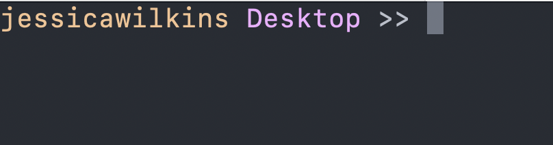

import { Aside, Code, Steps } from "@astrojs/starlight/components";

## What is Git?

Git is the most popular [disturbed version control system](https://en.wikipedia.org/wiki/Distributed_version_control) used to track changes for files and folders in a given project. Git allows you to easily manage your code and collaborate with other developers on the same project.

Git provides you with a detailed history of all of your changes for a given project. This makes it easy to review past updates, track progress over time, or even revert to earlier versions if needed.

Git also supports collaboration across the globe. Developers can work on their own local copies of a project and then push their changes to a shared repository—enabling teamwork without overwriting each other's work. You'll learn more about what a repository is and how to push changes in an upcoming section.

## Working with Git and the Command Line

Most of the examples in these guides, as well as the freeCodeCamp Discord workshops, will reference Git commands in the command line. The command line is a text-based interface that allows users to interact with the operating system by typing commands, which are executed by a command-line interpreter (also known as a shell).

You'll typically access the command line through a program called a terminal. Here is an example of my customized terminal:



If you are using a macOS, you can access the [Terminal application](https://support.apple.com/guide/terminal/get-started-pht23b129fed/2.14/mac/15.0) that already comes installed on your device. Another popular option would be [iTerm2](https://iterm2.com/)

If you are using Windows, you can use Command Prompt or [PowerShell](https://learn.microsoft.com/en-us/powershell/scripting/install/installing-powershell?view=powershell-7.5).

<Aside title="What about GUIs?">
    A Graphical User Interface (GUI) is a way to interact with your computer in a visual way instead of using text commands. For example, if you wanted to open a folder, then you can double click on it to see its contents.

    There are several <a href="https://git-scm.com/downloads/guis" target="__blank">GUI tools</a> like GitHub Desktop, and GitKraken that you can use in place of the command line.

    While there is nothing wrong with using these tools, it is good to know the basics of working with the command line.

</Aside>

## Installing Git on your Computer

Before you can begin working with Git, you need to first make sure it is installed on your computer.

Here is a [guide](https://git-scm.com/book/en/v2/Getting-Started-Installing-Git) on how to install Git for Linux, Mac and Windows.

To check if Git was properly installed, you can run the following command in the command line:

<Code language="bash" code="git --version" />

If you get back a version number like this, then that means it was installed properly.

<Code language="bash" code="git version 2.50.0" />

If you don't get back a version number, that means something probably went wrong with the installation process and you will need to try installing Git again.

## Setting up Git

Once Git is installed on your computer, there are a few configurations that you will need to setup.

Here is a [guide](https://git-scm.com/book/en/v2/Getting-Started-First-Time-Git-Setup) on how to setup those global configurations.

## Initializing a Git Repository

A repository(or repo for short) is a storage location (like a folder or project) where Git tracks all the changes made to files over time.

Let's walk through how to initialize a new empty Git repository.

<Steps>

1.  Open up your terminal.

2.  Use the following `cd`(change directory) command to navigate to a directory(also known as a folder) of your choice to create a new project. Here is an example of navigating to the `Desktop` directory on Mac.

    ```bash
    cd Desktop
    ```

3.  Use the `mkdir`(make directory) command to create an empty folder.

    ```bash
    mkdir example-git-project
    ```

4.  Then `cd` to that new folder.

    ```bash
    cd example-git-project
    ```

5.  Add a file using the `touch` command followed by the file name like this:

    ```bash
    touch README.md
    ```

    A `README.md` file is is a [markdown](https://www.markdownguide.org/) file that contains important information about your project. This will include project features, how to set it up and run it locally and how to contribute to the project if it is open source.
    Markdown is a markup language used mainly for documentation purposes like this `README.md` file.

6.  View your new file by running the `ls` command. You should only see the `README.md` file listed.

    ```bash
    README.md
    ```

7.  To initialize an empty Git repository, you will need to run the `git init` command. Otherwise, you will not be able to use Git to start tracking changes for this project.
    You should see the following output:

    ```bash
    Initialized empty Git repository in /Users/jessicawilkins/Desktop/example-git-project/.git/
    ```

    To view the `.git` folder, you can run the `ls -a` command which shows all files and folders including hidden ones like the `.git` directory.
    You should see this output:

    ```bash
    .         ..        .git      README.md
    ```

    The `.` refers to the current directory while the `..` refers to the parent directory. So in the example, the parent directory would be the `Desktop` directory.

</Steps>

<Aside type="caution" title="Should you delete the .git directory?">
    The `.git` directory holds very important information regarding your project.
    So if you remove it you will lose that history and your project will no longer
    be under version control. 
  
    The likelihood of you accidentally deleting in a
    normal daily scenario is pretty low. Especially since the `.git` directory is
    hidden by default.

    If you do decide to remove it, just make sure you understand the effects.

</Aside>

### What is inside of the .git directory?

If you want to take a peek inside of the `.git` directory, you can run the following commands:

```bash
cd .git
ls
```

You should see this output:

```bash
HEAD        config      description hooks       info        objects     refs
```

Here is a basic breakdown of all of those files and folders:

| Term        | Description                                                                                                                            |
| ----------- | -------------------------------------------------------------------------------------------------------------------------------------- |
| HEAD        | The main label pointing to the current version of the project. Think of it as a bookmark showing where you are right now in your work. |
| config      | Contains settings or options that control how the project behaves. Like a list of rules or preferences.                                |
| description | A short summary or name for the project. It helps you understand what the project is about.                                            |
| hooks       | Small scripts that run automatically before or after certain actions (like saving or sending a file). Useful for automation.           |
| info        | Contains general information about the project’s current state, such as version details.                                               |
|             |
| objects     | Stores the actual content (like files and versions). This is where most of the project's data lives.                                   |
|             |
| refs        | Short for "references." These are pointers to specific versions or branches in your project history.                                   |

If you are curious to dive deeper into the internals and plumbing of Git, then you can read through this [resource](https://git-scm.com/book/en/v2/Git-Internals-Plumbing-and-Porcelain#ch10-git-internals).
