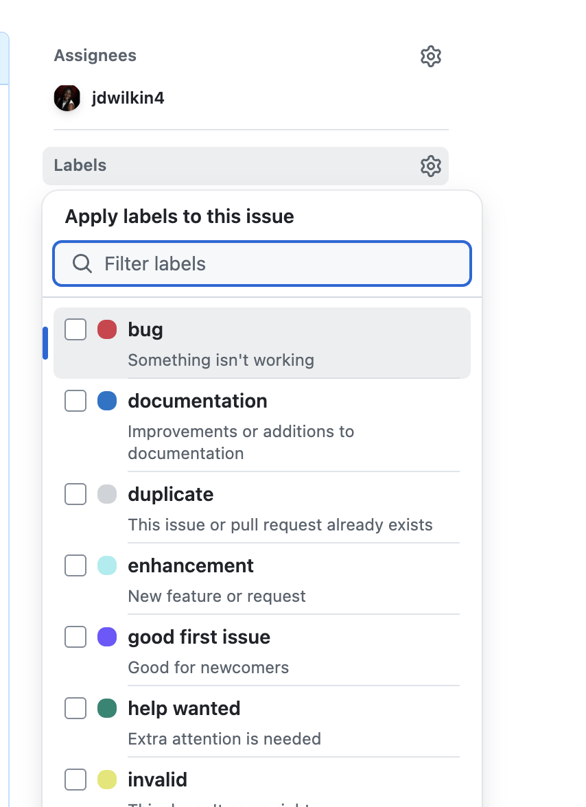

import { Aside, Steps } from "@astrojs/starlight/components";

## What is GitHub?

[GitHub](https://github.com/) is a platform used to create and manage your repositories. There are millions of users and repositories on GitHub.

Open Source projects will have GitHub repositories as well as solo developers and private companies.

GitHub utilizes Git and has many features like bug tracking, project boards, and more.

<Aside title="Are there other platforms like GitHub?">
  There are other platforms where you can create new repositories and
  collaborate on projects. Some of these other platforms include GitLab and
  Bitbucket. But GitHub is very widely used. So it is best to be familiar with
  it.
</Aside>

## How to Create a GitHub Account

Creating a personal GitHub account is free and will take only a few minutes. After your create the account, then you will need to verify your email address and then you can start using the platform.

For the full instructions on how to create an account, you can read the [documentation](https://docs.github.com/en/get-started/start-your-journey/creating-an-account-on-github).

<Aside title="Configuring two-factor authentication">
    2FA, or Two-factor authentication, provides an extra layer of security when you log in. For example, after providing your login details, you can use an authenticator app and provide a code to login.

    You can read more about how to configure this extra layer of security in the [documentation](https://docs.github.com/en/get-started/onboarding/getting-started-with-your-github-account#4-configuring-two-factor-authentication).

</Aside>

## How to Setup a GitHub Profile

Once you are logged in, you can create your GitHub profile. This is place where you can showcase your projects and tech stack. This allows for other developers and potential hiring managers to learn more about you.

Here is the full [documentation](https://docs.github.com/en/get-started/start-your-journey/creating-an-account-on-github) on how to setup your profile.

Some developers will choose to personalize their profiles beyond the basic setup. Here is an example of my [profile](https://github.com/jdwilkin4).


If you are interested in customizing your profile a little more, then you can read through this [helpful article](https://www.freecodecamp.org/news/create-personalized-github-profile-page/).

## How to Create a New Repository

In the [Git basics section](/guides/git-basics/), you learned about basic Git commands and how to create repositories locally. But you can create a new repository on GitHub and then pull that down locally.

To begin, click on the create icon located in the upper right hand corner of your profile page.


You can also choose to navigate to the `https://github.com/new` url.

As you can see, there is a lot of information on this page.


So let's break it down by section.

### Repository Template

A repository template is a starter that you can use to quickly create a new repository.
If you belong to one or more GitHub organizations, you might see options for organization-specific templates. You can also create your own templates by marking any repository as a template in its settings.

If you are interested in creating your templates, you can read about it in the [documentation](https://docs.github.com/en/repositories/creating-and-managing-repositories/creating-a-template-repository).

### Setting a Repository Name and Description

One of the required fields is the repository name. It is best to keep this short but descriptive.

### Public and Private Repositories

Public repositories can be seen by anyone regardless if they are logged in or not. Private repositories will only be shown to you and others that you choose invite to the repository.

Sometimes, organizations will have private repositories just for their teams. Also, there might be times where you don't want to share your projects with everyone and just want to keep it private.

To learn more about public and private repositories, you can review the [documentation](https://docs.github.com/en/repositories/managing-your-repositorys-settings-and-features/managing-repository-settings/setting-repository-visibility).

### Initializing the Repository With a README

When you create the repository, you have the option to add a README file now or later.
If you are planning to use an existing local project, then you might want to add the README file from that local project. Otherwise you can choose to create it now.

### Adding a `.gitignore` File

In the [Git basics section](/guides/git-basics/), you learned how to use Git to track changes to files and folders in your projects.
But you can tell Git to ignore certain files and folders. This is where the `.gitignore` file comes in.

Example files and folders that you would not want to have tracked by Git would be `.DS_Store` file, `node_modules` folder, `.env` file, etc.

GitHub provides you with a dropdown menu of many `.gitignore` file options for projects including Next.js, Python, Rails and more.

To learn more about the `.gitignore` file, you can read the [documentation](https://docs.github.com/en/get-started/git-basics/ignoring-files).

### Adding a License

A license for a project tells people what they can and cannot do with your code. There are many different licenses to choose from and this is a pretty expansive topic.

So if you are just creating a short demo project or practice project, you can ignore this field for now.
But if you are involved with larger projects, then you should learn about which license will be the best fit. I would suggest going through the [documentation](https://docs.github.com/en/repositories/managing-your-repositorys-settings-and-features/customizing-your-repository/licensing-a-repository) which has information on which license to choose.

## Connecting a Local Repository to GitHub Using a Remote Origin

In the [Git basics section](/guides/git-basics/), you learned how to create repositories locally using Git. But no one will see your local projects since it just lives on your computer.

If you want to have others see your project and collaborate with you, then you will need to connect it to a shared version on GitHub. This is where the `git remote add` command comes in.

A remote is a version of your repository hosted elsewhere. In this case, we have just created a remote repository on GitHub.

`origin` is the default name Git gives to the first remote repository you connect to your local repo.

You first need to find the new repository you created on GitHub. If you are unsure where to look, you can go to your GitHub profile page and click on the repositories tab. Then you should see the most recent repository at the top.

Then you will need to navigate to the command line and `cd` to the project you wish to connect to this remote repository.

Once you are in the project directory, you can run the following command:

```bash
git remote add origin https://github.com/your-github-username-here/your-repo-name-here.git
```

Don't forget to replace the `your-github-username-here` and `your-repo-name-here` placeholders with your actual information from GitHub.

To check the list of remotes connected to your local Git repository, you can run the following command:

```bash
git remote -v
```

You should see a similar output to mine here:

```bash
origin	https://github.com/jdwilkin4/example-github-project.git (fetch)
origin	https://github.com/jdwilkin4/example-github-project.git (push)
```

<Aside title="Working with SSH Keys">
    The earlier examples were working with the HTTPS URL(Ex. `https://github.com/jdwilkin4/example-github-project.git`). 
    But the more secure way to work with remotes is to use SSH URL.

    To learn more about SSH keys, you can review the [documentation](https://docs.github.com/en/authentication/connecting-to-github-with-ssh).

</Aside>

## Pushing Your Local Repository to GitHub

After you have set up your remote, you can push your local repository to GitHub using the `git push` command.

If you try to run this command in your local directory, then you might get this error:

```bash
fatal: The current branch main has no upstream branch.
To push the current branch and set the remote as upstream, use

    git push --set-upstream origin main

To have this happen automatically for branches without a tracking
upstream, see 'push.autoSetupRemote' in 'git help config'.
```

An upstream branch refers to the remote branch that your local branch is tracking. To resolve that error, you can take the suggestion that Git is providing you and run the following command:

```bash
git push --set-upstream origin main
```

You can also use the `git push -u origin main` command which will resolve the issue.

Now you should see this output:

```bash
Enumerating objects: 6, done.
Counting objects: 100% (6/6), done.
Delta compression using up to 8 threads
Compressing objects: 100% (2/2), done.
Writing objects: 100% (6/6), 465 bytes | 465.00 KiB/s, done.
Total 6 (delta 0), reused 0 (delta 0), pack-reused 0 (from 0)
To https://github.com/jdwilkin4/example-github-project.git
 * [new branch]      main -> main
branch 'main' set up to track 'origin/main'.
```

If you navigate back to GitHub and refresh the repository page, you should see your changes implemented.

<Aside title="How to auto setup remote branches">
    Every time you have a new branch and want to push that branch to your remote, you might see that `fatal: The current branch main has no upstream branch.` message.
    But you can update your Git config to automatically handle this situation for you.

    Here is a [helpful article](https://pawelgrzybek.com/auto-setup-remote-branch-and-never-again-see-an-error-about-the-missing-upstream/) on how to do that.

</Aside>

## Forking a Repository

There will be times where you will want to contribute to other repositories that aren't hosted on your personal GitHub account. This can include other solo developer repositories or organization repositories like freeCodeCamp.

In order to begin contributing you will need to fork the repository. A fork is your personal copy of another repository.

Let's say I am interested in contributing to the [Astro documentation](https://docs.astro.build/en/getting-started/).

On GitHub, I can go to the Astro docs GitHub repository, and click on the `Fork` button located in the upper right hand corner.


That will bring you to a page where you can click to create the fork and it should take a few seconds to create a new forked copy of the Astro docs.


## Cloning a Repository

If you have an existing repository on GitHub that you would like to have on your local computer, then you can clone the repository.

Navigate to the repository page and click on the `Code` button and copy the URL.


Then navigate to your terminal and run the following command:

```bash
git clone url-goes-here
```

The name for that repository will be the same name as the remote. If you would like to change it then you can run this command instead.

```bash
git clone url-goes-here new-repo-name
```

Now you will have the full remote repository on your local computer.

The next step is to sync up your fork with upstream.

<Steps>

1.  `cd` to your local forked copy:

    ```bash
    cd example-fork
    ```

2.  Run `git remote -v` to see the configured remote repository for the fork. You should see this output:

    ```bash
    origin  https://github.com/YOUR-USERNAME/YOUR-FORK.git (fetch)
    origin  https://github.com/YOUR-USERNAME/YOUR-FORK.git (push)
    ```

3.  Run `git remote add upstream url-goes-here`. Replace `url-goes-here` with your actual Git URL.
4.  Run `git remote -v`. You should see the following output:

        ```bash
        origin    https://github.com/YOUR-USERNAME/YOUR-FORK.git (fetch)
        origin    https://github.com/YOUR-USERNAME/YOUR-FORK.git (push)
        upstream  https://github.com/ORIGINAL-OWNER/ORIGINAL-REPOSITORY.git (fetch)
        upstream  https://github.com/ORIGINAL-OWNER/ORIGINAL-REPOSITORY.git (push)
        ```

</Steps>

## Creating Issues on GitHub

An issue is a place to report bugs, suggest feature requests, and other suggestions for the repository. You can find the issues tab on your repository on GitHub.

To create a new issue, you can click on the `New Issue` button.


If you have have [issue templates](https://docs.github.com/en/communities/using-templates-to-encourage-useful-issues-and-pull-requests/about-issue-and-pull-request-templates) setup on your repository, then you can pick from one of the templates. Otherwise, you will create a blank issue.

The issue editor supports [markdown](https://www.markdownguide.org/basic-syntax/) as well as plain text. You want to make sure your issues are descriptive and provide all of the context needed for maintainers to move forward.


If you are creating issues for your own repository, then you can assign it to yourself like this:


GitHub provides a set of labels for repository that you can add to your issues to label the type of issue it is.



The are many more ways to create an issue. You can explore your options in the [documentation](https://docs.github.com/en/issues/tracking-your-work-with-issues/using-issues/creating-an-issue).

## Creating Pull Requests on Github
