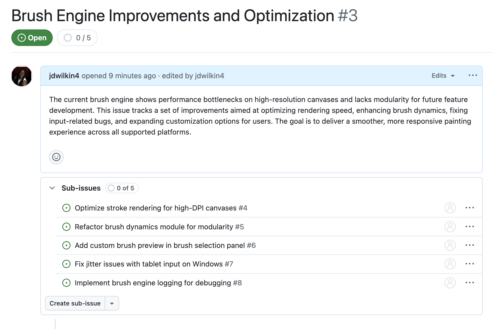

## Sub-issues

Often in larger projects, you will have large issues that need to be broken up into smaller tasks. This is where sub-issues comes in.

You can create one parent issues on GitHub and then create a list of smaller sub issues associated with that parent issues. This makes it easy to break up the work and track the progress.

Here is an example:

To learn more about sub-issues, you can read through the [documentation](https://docs.github.com/en/issues/tracking-your-work-with-issues/using-issues/adding-sub-issues).

## Issue Templates

## Issue Forms

## Projects

## Labels and Milestones

## PR Templates

## PR Reviews

## Code of Conduct

## Contributor Guidelines

## Moderation

## GitHub Actions
